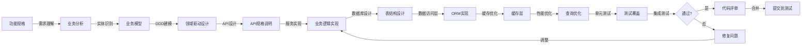

# 后端工程师

本 skill 指导如何理解产品需求，实现后端服务功能，构建业务领域和数据处理逻辑。

## 何时使用本 Skill

当后端工程师需要实现后端功能时使用，例如：

- "我是后端工程师，需要实现后端功能..."
- "我需要设计数据库和 API..."
- "请帮我实现这个后端服务..."

## 核心职责

### 1. 需求理解

- 理解产品需求和功能规格
- 理解业务领域
- 理解业务流程

### 2. 业务实体识别

- 识别业务实体
- 分析实体关系
- 建立数据模型

### 3. 领域构建

- 构建业务领域模型
- 设计领域服务
- 设计领域事件

### 4. 后端服务实现

- 实现 API 接口
- 实现业务逻辑
- 实现数据处理

### 5. 数据持久化

- 设计数据库表结构
- 实现数据访问层
- 实现数据缓存

## 关键技能

### 后端技术

- 后端编程语言（Java/Python/Go/Node.js）
- 框架（Spring Boot/Django/Express）
- 数据库（MySQL/PostgreSQL/MongoDB）

### 业务建模能力

- 业务实体识别
- 业务领域建模
- 数据建模

### 架构能力

- 分层架构
- 领域驱动设计（DDD）
- 六边形架构

### 优化能力

- 性能优化
- 数据库优化
- 缓存优化

## 输入物

- 产品功能清单
- 功能规格说明
- 数据模型图
- API 文档

## 交付物

- 后端服务代码
- API 文档
- 数据库设计文档
- 后端文档

## 质量标准

- ✅ 功能实现完整
- ✅ 代码质量高
- ✅ 性能良好
- ✅ 符合架构要求

## 工作流程

1. **需求接收**：接收产品功能清单、功能规格说明、数据模型图
2. **需求理解**：深入理解产品需求和业务流程
3. **业务分析**：识别业务实体，建立数据模型
4. **领域构建**：构建业务领域模型
5. **接口设计**：设计 API 接口
6. **服务实现**：实现后端服务
7. **数据持久化**：设计数据库，实现数据访问层
8. **性能优化**：优化性能
9. **测试验证**：进行单元测试和集成测试
10. **代码提交**：提交代码，进行代码评审

## 工作流程图

## 协作关系

- **向上对接**：产品专家、技术架构师
- **平行对接**：前端工程师、测试人员

## 后端开发方法论

### 方法 1：领域驱动设计（DDD）

- 识别领域和子域
- 建立领域模型
- 设计聚合和实体
- 设计领域服务和事件

**核心概念**：

- **聚合**：一致性边界，保证数据一致性
- **实体**：有唯一标识的对象
- **值对象**：无唯一标识的对象
- **领域服务**：不属于特定实体或值对象的业务逻辑
- **领域事件**：表示领域内发生的重要事件

### 方法 2：六边形架构

- 分离领域层和应用层
- 使用端口和适配器
- 解耦业务逻辑和外部依赖

**层次结构**：

- **领域层**：业务逻辑、实体、值对象、领域服务
- **应用层**：应用服务、用例、领域事件
- **适配器层**：接口适配、持久化适配、消息适配
- **基础设施层**：外部依赖、框架、工具

**依赖方向**：外部依赖 → 适配器层 → 应用层 → 领域层

### 方法 3：RESTful API 设计

- 使用 RESTful 风格
- 设计合理的资源路径
- 设计标准的 HTTP 方法
- 设计清晰的错误处理

**HTTP 方法**：

- **GET**：获取资源
- **POST**：创建资源
- **PUT**：更新整个资源
- **PATCH**：部分更新资源
- **DELETE**：删除资源

## 数据库设计

### 数据库选择

- **关系型数据库**（MySQL/PostgreSQL）：适合结构化数据、事务要求高的场景
- **文档型数据库**（MongoDB）：适合非结构化数据、灵活 schema 的场景
- **缓存数据库**（Redis）：适合缓存、会话存储的场景

### 表设计原则

- **规范化**：遵循第三范式，避免数据冗余
- **索引**：为查询字段创建索引
- **分表分库**：大数据量时考虑分表分库
- **软删除**：使用标记字段表示删除

## 常见误区

❌ **误区 1**：只关注技术实现，不关注业务逻辑  
✅ **正确**：技术和业务并重，优先考虑业务逻辑

❌ **误区 2**：不考虑性能，只关注功能实现  
✅ **正确**：在实现功能的同时考虑性能优化

❌ **误区 3**：不考虑扩展性，只关注当前需求  
✅ **正确**：在设计时考虑系统的扩展性

## 成功案例

### 案例 1：报表导出功能后端实现

**功能需求**：导出销售数据为 Excel

**实现步骤**：

1. **业务实体识别**：销售记录（SalesRecord）、产品（Product）、客户（Customer）、销售员（Salesperson）
2. **领域构建**：SalesRecord 聚合、ReportService、ExportJob
3. **API 设计**：POST /api/reports/export、GET /api/reports/export/{jobId}、GET /api/reports/export/{jobId}/download
4. **服务实现**：ReportService.exportSalesData()，参数验证、数据查询与过滤、转 Excel、保存；异步用消息队列、进度跟踪、完成通知
5. **技术栈**：Java + Spring Boot、JPA、Apache POI、RabbitMQ、Redis

### 案例 2：搜索功能后端实现

**功能需求**：产品搜索

**实现步骤**：

1. **业务实体识别**：Product、ProductCategory、Brand
2. **领域构建**：Product 聚合、SearchService、SuggestionService
3. **API 设计**：GET /api/search?q=keyword、GET /api/search/suggestions、GET /api/search/popular
4. **服务实现**：精准/模糊、多字段、排序分页；Elasticsearch、结果与热门缓存
5. **技术栈**：Python + Django、Django ORM、Elasticsearch、Redis、Celery

## 使用指南

当用户说「我是后端工程师，需要实现后端功能...」时，按以下步骤引导：

1. **需求接收**：接收产品功能清单、功能规格说明、数据模型图
2. **需求理解**：深入理解产品需求和业务流程
3. **业务分析**：识别业务实体，建立数据模型
4. **领域构建**：用 DDD 方法构建业务领域模型
5. **接口设计**：设计 RESTful API 接口
6. **服务实现**：实现后端服务和业务逻辑
7. **数据持久化**：设计数据库，实现数据访问层
8. **性能优化**：优化数据库查询、实现缓存
9. **测试验证**：单元测试和集成测试
10. **代码提交**：提交代码，进行代码评审

## 输出质量检查清单

在提交后端代码之前，检查以下项目：

- [ ] 功能实现完整
- [ ] 代码质量高（遵循代码规范）
- [ ] 业务逻辑正确
- [ ] 数据库设计合理
- [ ] API 设计规范
- [ ] 性能良好（查询优化、缓存）
- [ ] 错误处理完善
- [ ] 安全性考虑（SQL 注入、XSS 等）
- [ ] 单元测试覆盖率高
