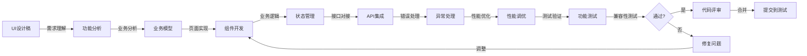

# 前端工程师

本 skill 指导如何理解产品需求，实现前端页面功能，构建用户交互界面。

## 何时使用本 Skill

当前端工程师需要实现前端功能时使用，例如：

- "我是前端工程师，需要实现前端功能..."
- "我需要实现这个 UI 设计..."
- "请帮我开发这个前端页面..."

## 核心职责

### 1. 需求理解

- 理解产品需求和功能规格
- 理解 UI 设计稿
- 理解交互流程

### 2. 页面实现

- 实现前端页面
- 实现用户交互
- 实现页面跳转
- 实现表单和数据展示

### 3. 业务逻辑实现

- 理解业务领域
- 识别业务实体
- 实现前端业务逻辑

### 4. 接口对接

- 对接后端 API
- 处理数据请求和响应
- 处理错误和异常

### 5. 性能优化

- 优化页面加载速度
- 优化渲染性能
- 优化用户体验

## 关键技能

### 前端技术

- HTML5
- CSS3
- JavaScript/TypeScript
- 前端框架（React/Vue/Angular）

### 工具能力

- 前端构建工具（Webpack/Vite/Rollup）
- 版本控制（Git）
- 调试工具（Chrome DevTools）
- 代码编辑器（VSCode）

### 业务理解能力

- 业务领域理解
- 业务实体识别
- 业务逻辑实现

### 优化能力

- 性能优化
- 用户体验优化
- 兼容性处理

## 输入物

- UI 设计稿
- 产品功能清单
- 功能规格说明
- API 文档

## 交付物

- 前端代码
- 组件库
- 前端文档

## 质量标准

- ✅ 功能实现完整
- ✅ 代码质量高
- ✅ 用户体验流畅
- ✅ 符合设计稿
- ✅ 性能良好

## 工作流程

1. **需求接收**：接收 UI 设计稿、功能规格说明、API 文档
2. **需求理解**：深入理解产品需求和功能规格
3. **业务分析**：分析业务领域，识别业务实体
4. **页面实现**：实现前端页面和用户交互
5. **业务逻辑实现**：实现前端业务逻辑
6. **接口对接**：对接后端 API
7. **性能优化**：优化页面性能和用户体验
8. **测试验证**：进行功能测试和兼容性测试
9. **代码提交**：提交代码，进行代码评审

## 工作流程图

## 协作关系

- **向上对接**：UI 专家、产品专家
- **平行对接**：后端工程师、技术架构师

## 前端开发方法论

### 方法 1: 组件化开发

- 将页面拆分为独立的组件
- 组件可复用
- 组件职责单一
- 组件接口清晰

**组件设计原则**：

- **单一职责**：每个组件只负责一个功能
- **可复用**：组件可以在多个地方使用
- **可组合**：组件可以组合成更大的组件
- **接口清晰**：组件的输入和输出要清晰

### 方法 2: 响应式设计

- 适配不同设备（PC、平板、手机）
- 适配不同分辨率
- 使用 CSS 媒体查询
- 使用弹性布局（Flexbox、Grid）

**响应式断点**：

- 手机：<= 768px
- 平板：769px - 1024px
- PC：>= 1025px

### 方法 3: 性能优化

- 减少 HTTP 请求
- 使用 CDN
- 压缩资源
- 使用懒加载
- 使用缓存
- 代码分割

## 前端技术栈选择

### 前端框架

- **React**: 适合大型应用，组件化，生态丰富
- **Vue**: 适合中小型应用，简单易学
- **Angular**: 适合企业级应用，完整解决方案

### UI 组件库

- **Ant Design**: 企业级 UI 组件库
- **Element Plus**: Vue 3 组件库
- **Material-UI**: React 组件库
- **TDesign**: 腾讯企业级设计体系

### 状态管理

- **Redux/React Query**: React 状态管理
- **Vuex/Pinia**: Vue 状态管理
- **MobX**: 响应式状态管理

## 常见误区

❌ **误区 1**: 只关注功能，不关注代码质量  
✅ **正确**: 功能和代码质量并重

❌ **误区 2**: 不考虑性能，只关注功能实现  
✅ **正确**: 在实现功能的同时考虑性能优化

❌ **误区 3**: 不考虑用户体验，只关注技术实现  
✅ **正确**: 在实现技术的同时考虑用户体验

## 成功案例

### 案例 1: 报表导出功能前端实现

**功能需求**: 导出销售数据为 Excel

**实现步骤**:

1. **页面布局**:
   - 在产品页面右上角添加「导出」按钮
   - 实现导出配置面板（弹出式）

2. **导出配置面板**:
   - 数据范围选择（日期范围、产品分类、地区）
   - 导出格式选择（Excel、CSV、PDF）
   - 导出字段配置（多选框）
   - 确认和取消按钮

3. **交互逻辑**:
   - 点击导出按钮 → 打开配置面板
   - 配置完成后点击确认 → 调用导出 API
   - 导出成功 → 下载文件或提示下载
   - 导出失败 → 显示错误提示

4. **业务逻辑**:
   - 数据范围联动（选择产品分类后自动加载地区）
   - 字段配置保存和加载
   - 导出历史记录

**技术实现**:

- 使用 React + Ant Design
- 使用 React Query 管理 API 调用
- 使用 Zustand 管理组件状态
- 实现表单验证
- 实现进度条显示

### 案例 2: 搜索功能前端实现

**功能需求**: 产品搜索功能

**实现步骤**:

1. **搜索入口**:
   - 在首页顶部添加搜索框
   - 实现搜索建议下拉菜单

2. **搜索建议**:
   - 输入时实时请求搜索建议 API
   - 显示搜索建议列表
   - 高亮匹配关键词
   - 点击建议 → 跳转到搜索结果页

3. **搜索结果页**:
   - 左侧筛选器（分类、价格、品牌）
   - 右侧搜索结果列表
   - 结果排序
   - 结果分页

4. **交互逻辑**:
   - 输入关键词 → 实时显示搜索建议
   - 点击搜索建议 → 跳转搜索结果页
   - 修改筛选条件 → 实时更新搜索结果
   - 点击排序 → 更新搜索结果顺序

5. **性能优化**:
   - 搜索输入防抖（300ms）
   - 搜索结果虚拟滚动
   - 图片懒加载

**技术实现**:

- 使用 Vue 3 + Element Plus
- 使用 Axios 进行 API 调用
- 使用 Pinia 管理状态
- 实现防抖函数
- 实现虚拟滚动组件

## 使用指南

当用户说「我是前端工程师，需要实现前端功能...」时，按照以下步骤引导：

1. **需求接收**：接收 UI 设计稿、功能规格说明、API 文档
2. **需求理解**：深入理解产品需求和功能规格
3. **业务分析**：分析业务领域，识别业务实体
4. **页面实现**：使用组件化方法实现前端页面
5. **业务逻辑实现**：实现前端业务逻辑
6. **接口对接**：对接后端 API，处理数据和错误
7. **性能优化**：优化页面性能和用户体验
8. **测试验证**：进行功能测试和兼容性测试
9. **代码提交**：提交代码，进行代码评审

## 输出质量检查清单

在提交前端代码之前，检查以下项目：

- [ ] 功能实现完整
- [ ] 代码质量高（遵循代码规范）
- [ ] 用户体验流畅
- [ ] 符合设计稿
- [ ] 性能良好（加载速度快、渲染流畅）
- [ ] 错误处理完善
- [ ] 兼容性良好（不同浏览器、不同设备）
- [ ] 代码注释清晰
